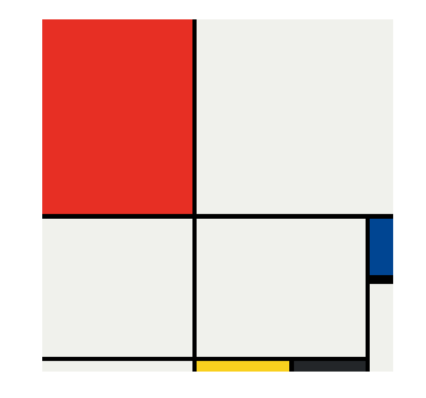

# Full-Stack Web Development  

---

 I've completed a 62-hour Udemy course covering a range of technologies including: **JavaScript, React.js, HTML5, CSS3, Bootstrap, Node.js, Express.js, APIs, EJS, SQL, PostgreSQL, Deployment, Authentication, and even explored Web3 and DApps.**  
Join me on this journey as I continue to learn and master the exciting world of web development!  
 

### Backend Projects

<!-- -   [Mailchimp API Email Signup]() -->
- [Secrets Generator](https://secrets-project-t06a.onrender.com/)

- [API Authentication](https://api-authentication-u9xk.onrender.com)

- [Random Activity Generator](https://random-activity-generator-60ez.onrender.com)

- [API Taco Recipes](https://api-taco-recipes-hbt7.onrender.com)

- [Band Generator](https://band-generator-project.onrender.com)

### Frontend Projects

- [Basic Bootstrap Website](https://hussien-lts.github.io/Basic-Bootstrap-Website//)

- [Tindog](https://hussien-lts.github.io/TinDog-Project/)

- [Simon Game](https://hussien-lts.github.io/Simon-Game/)

- [My Personal Website](https://hussien-lts.github.io/My-Personal-Website/)

- [Drum Kit](https://hussien-lts.github.io/Drum-Kit/)
- [Dice Challenge](https://hussien-lts.github.io/Dicee-Challenge/)
- [HTML Only Online Resume](https://hussien-lts.github.io/HTML-Porfolio-Project/)

<!-- ### Web Design - UI/UX experience -

3 page hotel website design via Canva:
 -->

---
 

## My Projects

## QR code Generator - backend only  

- This project utilizes the **inquirer** npm package to prompt users for input. It then employs the **qr-image** npm package to generate a QR code image based on the URL provided by the user. Finally, it utilizes the native fs node module to create a text file to store the user's input.

 

## HTTP Requests  

- HTTP - language that allows computers to talk to each other across the internet.
Request Vocabulary:

  - GET: retrieve information
  - POST: send information
  - PUT: replace resources with new information
  - PATCH: patch up (fix) a resource
  - DELETE: delete existing information of the specified source

---
 

## Postman  

### Postman is a tool that allows us to test our backend without needing a frontend. We can test our routes and see what data is being sent back to us

- Test different routes, while the server running with nodemon

---
 

## Express Middleware and Custom Middleware

Middleware is a function that runs between the `request` and the `response`.
It can be used for a variety of things, such as logging, authentication, and more.
Middleware functions can be used with the `app.use()` method.

---
 

## 📁 Passing data in EJS

- EJS work almost like having a little JavaScript module that can run JavaScript code inside a HTML file, and it ends with the .ejs file extension.

- And essentially all we've got is just HTML but with bits of JavaScript enclosed inside a special syntax

---

 

## 📁 Formatting API requests

I can call it private API.
If I want my server to talk to someone else's server and back
(get some data, and interact with that server) - it will be also in Request and Response, but this time it's done
via a public API.

---
 

## 📁 Band Generator Project (Express + ejs files)

---
 

## 📁 JSON + Express  

---
 

## Axios + API (Random Activity Generator)

---
 

## API Authentication

#### Check out the application [here](https://api-authentication-u9xk.onrender.com)

- The API used for this project is `https://secrets-api.appbrewery.com/`
- Basic authentication uses username and password, and base64 encoding to authenticate the user.
- Token-based auth is more secure because we get the user to use a username and password to log in, and once they get in we generate a token, to be used with the API.
  So the API doesn't get involved with the username and password, and instead it's the token that is used to interact with the API.
- Normally I'll see token-based auth as OAuth 2.0, which is a standard for token-based auth.
  In 3rd party apps, I'll see OAuth 2.0. for example, when I log in to a website using my google account, I'll get a token that I can use to interact with the API.  
  (so I don't have to give my username and password of google to the 3rd party app, instead, I give them a token, and they use that token to interact with the API.)

#### Authentication + REST API

- `Basic Authentication` is required for some endpoints. Use your `username and password` to authenticate.
- An `API Key` is required to `Authorize` certain endpoints. Use the API key obtained from the /generate-api-key endpoint.
- `Bearer Token` Authentication is required for some endpoints. Use your `username and password` to get a token obtained from the /get-auth-token endpoint.

#### Difference between Authentication and Authorization

Authentication is the process of `verifying who you are (user`, to the API provider.
Authorization is the process of verifying  what the client is allowed to do. and they get an  `API key to authorize themself`. Allows you to use an API.

## 📁 Databases -

### SQL DB-

Structured Query language.
some SQL sources: oracle, MySQL, PostgreSQL, SQLite. (free and paid).

### NoSQL DB-

it's possible to change the Structure of the data afterwards.

---
 

## 📁 postgreSQL + pgAdmin tables

- to connect to the DB we need some details to verify ourselves.
- I use the pg package to connect to the DB and send queries to the DB.
- Then I connect to the DB, and send queries to the DB, with db.query. with SQL code inside (structured query language).
- I use a PostgreSQL server, with pgAdmin DB.

---
 

## 📁 Travel Tracker (PostgreSQL)

- repo link [Here](https://github.com/Hussien-LTS/travel-tracker)

- deployed Link [Here](https://travel-tracker-1-83yd.onrender.com)

---
 

## Frontend Based Projects

### Simon Game- JQuery

- repo link [Here](https://github.com/Hussien-LTS/Simon-Game)

- deployed Link [Here](https://hussien-lts.github.io/Simon-Game/)

---
 

### Drum Kit - HTML + JavaScript  

- repo link [Here](https://github.com/Hussien-LTS/Drum-Kit)

- deployed Link [Here](https://hussien-lts.github.io/Drum-Kit/)

## 📁 Dice Challenge - JQuery -

- repo link [Here](https://github.com/Hussien-LTS/Dicee-Challenge)

- deployed Link [Here](https://hussien-lts.github.io/Dicee-Challenge/)

## 📁 TinDog Project - HTML Only

- repo link [Here](https://github.com/Hussien-LTS/TinDog-Project)

- deployed Link [Here](https://hussien-lts.github.io/TinDog-Project)

## 📁 Bootstrap Components -

- repo link [Here](https://github.com/Hussien-LTS/Basic-Bootstrap-Website/)

- deployed Link [Here](https://hussien-lts.github.io/Basic-Bootstrap-Website/)

## 📁 Mondrian Project - Grid

- repo link [Here](https://hussien-lts.github.io/Mondrian-Project/)

- deployed Link [Here](https://hussien-lts.github.io/Mondrian-Project/)

---
 

## 📁 Flex box Pricing Table Project

## Topics Covered 📌

### Web Development Fundamentals

1. HTML5
2. CSS3
3. Flexbox
4. Grid
5. Bootstrap
6. Web Design
7. Document Object Model (DOM)
8. JavaScript ES6
9. React.js
10. Node.js
11. Express.js
12. Application Programming Interfaces (APIs) and HTTP
13. EJS
14. Database Fundamentals
15. SQL Databases
16. PostgreSQL
17. Deployment
18. Building RESTful APIs
19. Authentication and Security
